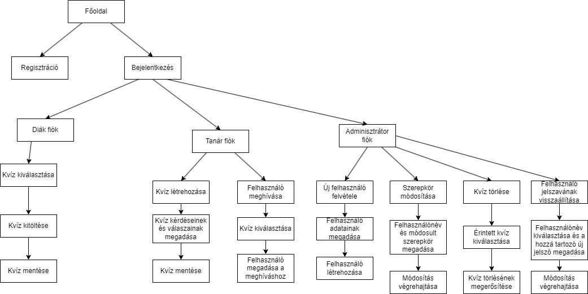
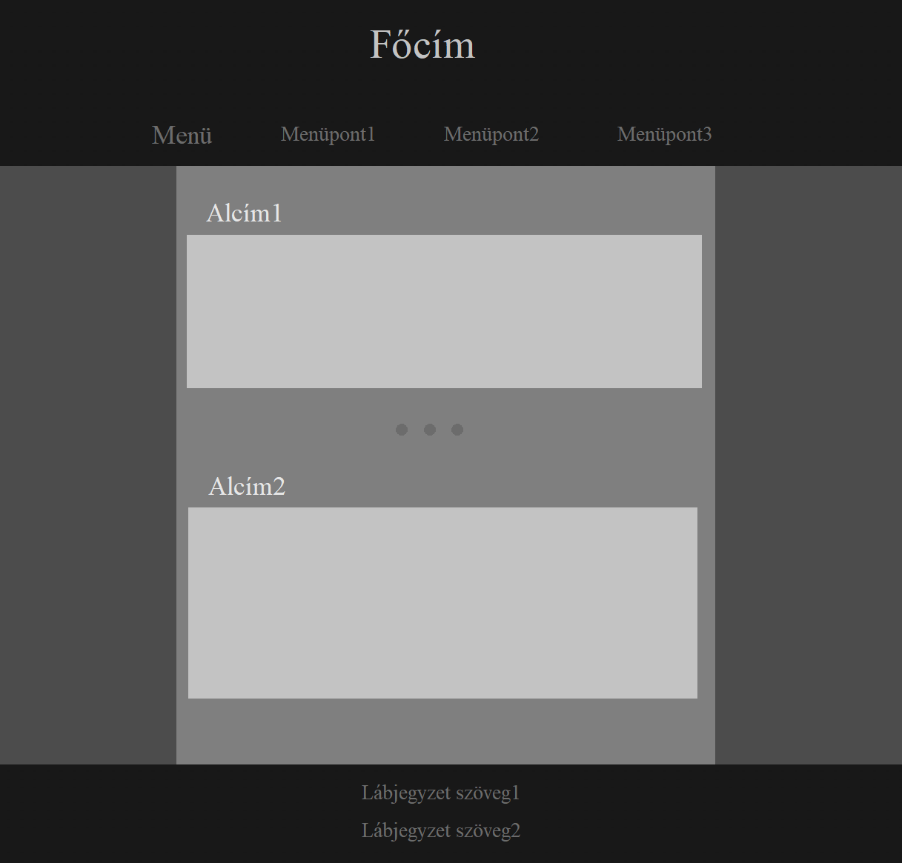
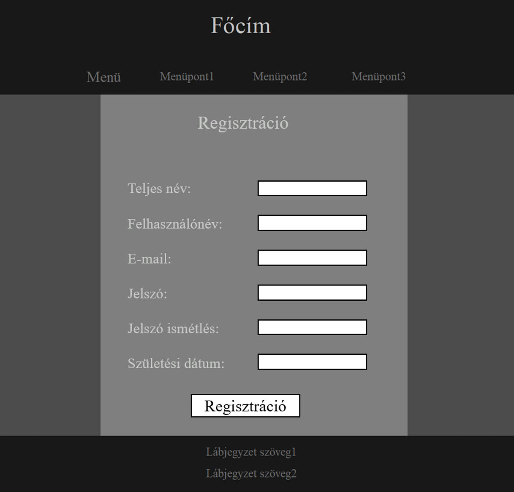
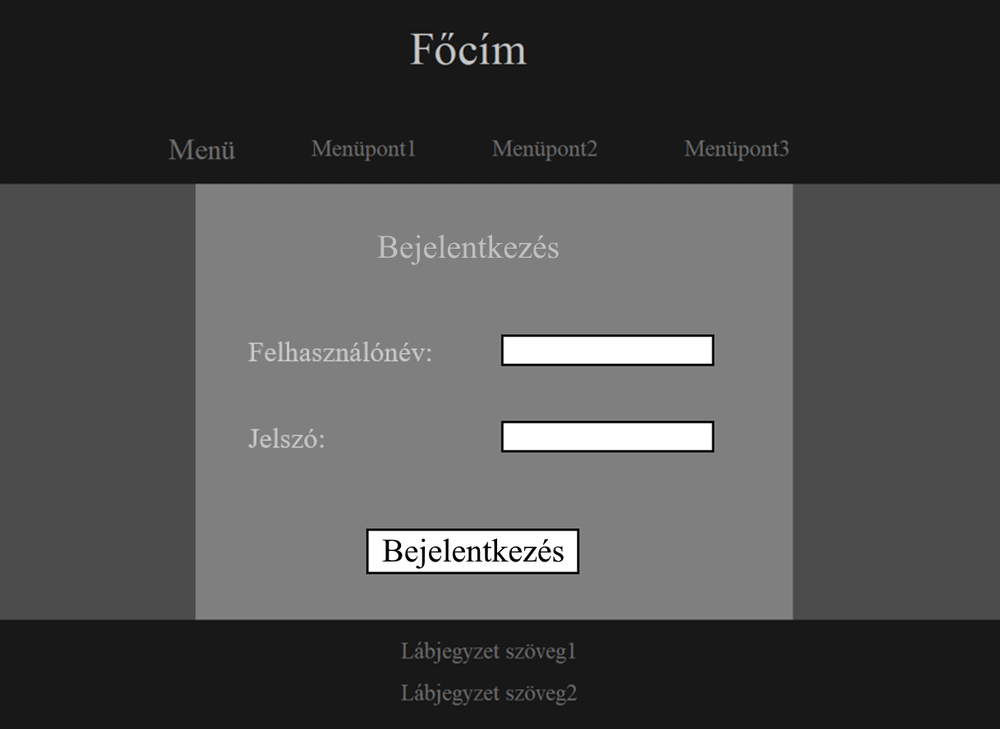

<b>Funkcionális specifikáció</b>
 
Q-easy – 

Jelen funkcionális specifikáció azon követelményeket tartalmazza, amelyekre
a szoftvernek reagálnia szükséges és definiálja azt is, hogy ez milyen
módon történjen meg.

<h2>Követelménylista</h2>
<h3><b>Regisztráció:</b></h3>
Az alkalmazás használata kizárólag a regisztrációt követően válik elérhetővé.
Ehhez szükséges egy regisztrációs űrlap kitöltése. A regisztrációt űrlap
a következő mezőkkel fog tervezetten rendelkezni, ezek közül * jelzi a kötelező
mezőket:

Név*

Felhasználónév*

Jelszó*

Email*

Születési dátum

* Amikor a felhasználó rákattint a regisztráció gombra, akkor egy új fülön
egy regisztráció ablaknak kell megnyílnia.
* Amikor a felhasználó az adatok begépelése közben egy kötelező mezőt üresen
hagyott, a programnak üzenettel kell tájékoztatni a kitöltendő mező fontosságáról.
* Amikor a felhasználó az összes szükséges adatot begépelte és rákattintott a
regisztráció gombra, a rendszernek meg kell vizsgálnia, hogy ilyen felhasználó
névvel történt-e már regisztráció, és amennyiben igen,tájékoztatnia kell erről
a regisztrációt indító felhasználót.
* Amennyiben a begépelt felhasználónév szabad, a rendszernek az adatokat lementve
létre kell hoznia egy felhasználói fiókot.
* Ha a fiók létrehozása sikeresen megtörtént, a rendszernek vissza kell irányítania
a felhasználót a bejelentkezési oldalra és tájékoztatnia a sikeres regisztrációról.
* Az adminisztrátorok létrehozására kizárólag hozzáadással legyen lehetőség, kimondottan
regisztrálni adminisztrátort tilos!

<h3><b>Bejelentkezés:</b></h3>
A regisztrációt követően a felhasználónak lehetősége nyílik a bejelentkezésre
és ezáltal a program nyújtotta további funkciók igénybevételére. Ehhez szükséges
egy bejelentkező űrlap, ahol a felhasználónak a regisztrációkor megadott
felhasználónevét és jelszavát kell használnia. Az űrlap tervezett mezői:

Felhasználónév*

Jelszó*

* Amikor a felhasználó begépeli a felhasználónevét és jelszavát, a rendszernek
le kell ellenőriznie, hogy van-e ilyen felhasználónév+jelszó kombinációval
felhasználó létrehozva.
* Amennyiben nincs, úgy tájékoztassa a felhasználót arról, hogy valamilyen adat
nem megfelelően lett begépelve.
* Amennyiben az adatok helyesek és a regisztrált fiók megtalálásra került,
jelentkeztessük be a felhasználót és töltődjön be számára az alkalmazás főoldala.
* A diákok, tanárok és adminisztrátorok bejelentkezése ugyan azon a bejelentkezési
fülön kell, hogy megtörténjen.

<h3><b>Adminisztrátor általi felhasználó felvétele:</b></h3>
A felhasználók között lesznek adminisztrátorok, akiknek lehetőségük van felhasználókat regisztrálni. Ehhez szükséges
a szokásos felhasználó regisztrációs adatokat megadni, valamint egy egyedi (például felhasználónév) megadásával
hitelesítenie magát a user-nek. Ezt követően még a regisztrálandó user szerepkörét is szükséges megadni.
Tervezett kötelező mezők (*-al jelölve):

Igénylő*

Név*

Felhasználónév*

Jelszó*

Email*

Szerepkör*

* Amikor az adminisztrátor begépeli a készülendő felhasználó felhasználónevét és jelszavát, a rendszernek
le kell ellenőriznie, hogy van-e ilyen felhasználónév+jelszó kombinációval
felhasználó létrehozva.
* Amennyiben nincs, úgy tájékoztassa az adminisztrátort arról, hogy ha valamilyen adat
nem megfelelően lett begépelve.
* Amennyiben az adatok helyesek és a regisztráció sikeresen lezajlott, tájékoztassuk a sikerességről az adminisztrátor.
* A diákok, tanárok és adminisztrátorok regisztrálása adminisztrátor jogkörű felhasználó által ugyan azon a
fülön kell, hogy megtörténjen.

<h3><b>Adminisztrátor általi felhasználó jelszavának módosítása:</b></h3>

Igénylő*

Felhasználónév*

Új jelszó*

* A rendszer jelezze, ha valamilyen adatok kötelezőek és kitöltendőek.
* Amennyiben ilyen felhasználónevű felhasználó nem létezik, tájékoztassa az adminisztrátort üzenettel a rendszer.
* Ha sikerült a felhasználó jelszavát módosítani, tájékoztassa a rendszer az adminisztrátort.
* Ha valami végett adatbázis hiba lépne fel, akkor arról is tájékoztasson a rendszer.

<h2>Kvíz törlés</h2>

Csak admin jogosultsággal lehetséges. Amikor az adminisztrátor megadja, hogy melyik kvízt 
szeretné törölni, két dolgot feltétlen meg kell nézni
1: Csak adminisztrátor férhet hozzá ehhez a funkcióhoz
2: Létzeik-e az a kvíz amit törölni szeretne (Ezt id alapján kéri le)
Amennyiben ez a két feltétel teljesül, a kiválasztott kvíz törlésre kerül-

<h2>Jelenlegi üzleti folyamatok modellje</h2>

A mai modern korban az oktatás és a tanulást segíti, egyszerűsítő technológiák használata
még nem ment keresztül elég széleskörű térhódításan a közoktatásban. A diákok sokszor keresik
a tanulást segíti és interaktív megoldásokat céljaik elérésében. A legtöbb tanár papír alapon
ad "tesztdolgozatokat" avagy rövid kvízeket, hogy a diákok tudását felmérje, és, hogy a diákok
gyakorolni tudjanak. Az ebből származó kinyomtatott formájú papírok, pedig elég magas nyomdai
költséget jelentenek, valamint a tanárnak egyesével kell a dolgozatokat javítania, amely ismételten
időt és pénzt emészt fel. A XXI. században pedig ezen költségek jelentősen csökkenthetőek lennének.

<h3><b>A készülendő szoftver navigációs vázlata:</b></h3>

<h3>Frontend tervek</h3>

* Alapszínek: az alapszíneket alapvetően a sötét háttérszínek és a világos szövegszínek dominálják. 
fontos, hogy a szövek minden oldalon, jól látható és olvasható legyen, simonjon bele a sötétebb 
háttérbe. A weboldal háttere egy sötét témájú, könyveket és könyvespolcokat megjelenítő, fixált kép legyen.
* Fejléc és navigáció: a teljes fejléc horizontálisan kitölti a teljes képernyőt, háttere sötétszürke színű, 
amely fentről lefelé egy színátmenetet képezzen a fekete és a sötétszürke között. A fejléc tartalmazza a weboldal címét (h1) nagy méretű karakterekkel (3rem) amely kitölti a fejléc kétharmadát. A h1-es főcím színe világos szürke 
és a többitől eltérő 'DiplomataSC' betütípussal rendelkezzen. A további egyharmad részt a navigáció és az ahhoz tartozó menüpontok töltsék ki. A menüpontok mérete legyen 50%-al nagyobb, színe szürke, illetve betűtípusa 'PatrickHand'. A menüpontok nagyobb kijelzőméret esetén horizontálisan, egymás mellett helyezkednek el, kis kijelző esetén vertikálisan, egymás alatt.
* Oldalak (main): az oldal tartalmi része 1200px széles, margóval középre igazított. A main háttere szürke színű és
áttersző, a háttérkép mögötte kissé homályosan, elmosódva látszik. Kis kijelző esetén, az említett háttérszín kitölti a kijelzőt. A szöveg színe világosszürke színű, a sormagasság 1.6 rem, a betűtípus 'Georgia'. Az alcímek (h2) színe megegyezik, méretük az alapméret, a betűtípus pedig 'Marmelad'. A alcímek továbbá kapnak egy lefelé irányuló 
szövegárnyékolást, amely kissé kiemeli őket a térből. A téma részek egy néhány középre igazított, nagyobb méretű pontból álló, áttetsző vanallal (hr) lesz elszeparálva.
* Lábléc: háttere megegyezik a fejlécével, azzal a különbséggel, hogy a színátmenet fordított irányú, tehát fentről 
lefelé sötétedik. A szöveg színe itt a navigációhoz hasonlóan szürke színű, középre igazított. A lábléc tartalmaz egy lap 
tetejére szöveget egy hozzá tartozó, felfelé mutató nyilat ábrázloló, kis méretű képpel. Ez minden oldalon a lap tetejére, 
a navigációs részhez viszi a kijelzőt.
* Reszponzitivtás: A webplapok tervezésekor érvényesült a mobile-first megközelítés, miszerint a szolgáltatás elérhető kis 
kijelzőjű eszközök esetén is. A 750px alatt a html tag-hez tartizó font-size 18px, amivel a rem-ben számolt méretek és a 
betűnéret is kisebb lesz. Ezen kívül a nagyméretű főcím is kisebb méretet kap, a Menü szó eltűnik a navigációból, valamint 
a menüpontok vertikálisan rendeződnek egymás alá. A form-okat tartalmazó kontének a teljes kijelző hosszában kiszélesedik 
és a flexbox-ba helyezett label és input mezők is egymás alá helyeződnek, így csökkentve a szélességet.

<h4>Front-end alapdesign</h4>

<h4>Regisztráció alapdesign</h4>

<h4>Bejelentkezés alapdesign</h4>

