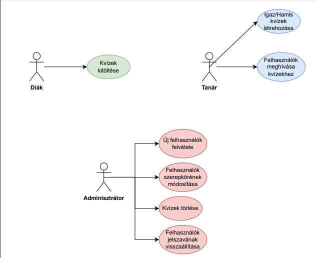

<b>Követelményspecifikáció</b>
 
<h3>Áttekintés</h3>
Q-easy – 

A Q-easy egy böngészős alkalmazás, mely tanároknak segít feladatválasztós quizeket létrehozni, valamint ezen kvízekhez tanulóit invitálni. Nyomon követheti, hogy mely tanulója milyen sikerekkel képes elvégezni az elkészített kérdéssorokat. 
Külsős személyek ne tudjanak regisztrálni a rendszerbe.
A Q-easy lehetőséget nyújt arra, hogy a tanulók megtekinthessék eredményeiket.
Legyen egy olyan szerepkör, aki tud rögzíteni felhasználókat és tudja kezelni őket, valamint be is tudja állítani, hogy az illető személy Tanár vagy Diák.
Egy felhasználó rendelkezhessen több szerepkörrel is.
Ezen adatokat az alkalmazás adatbázisban kell, hogy tárolja.
Az adatok visszaállítására legyen lehetőség.

<h3>Jelenlegi helyzet</h3>

Jelen álláspont szerint a diákok legtöbbször papír alapon tudnak kvízeket kitölteni,
és azt nem kell részletezni, hogy ez milyen többletmunkát, nyomtatási papírmennyiséget
és időt emészt fel. A diákok általában 1-1 kvízt tudnak kitölteni és ezáltal gyakorolni egy
esetleges vizsgára. A Q-easy rendszer segítségével a nyomtatott papírok mennyisége csökken,
a tanárok pedig néhány kattintás segítségével tudják kvízeiket összeállítani. Ez megkönnyíti a
tanárok munkáját és segíti a diákokat, hogy egy esetleges dolgozatra hatékonyabban legyenek képesek
felkészülni a tanár által biztosított gyakorló kvízek segítségével. A papír alakú kvízekkel
továbbá probléma, hogy a tanár csak kijavítja, bejelöli, hogy az adott kérdésre a válasza helytelen,
de nem jelzi, hogy mi lett volna a helyes, valamint a diákok nem tudnak annyit tanulni, amennyit esetlegesen
kellene nekik, avagy szeretnének. A Q-easy szoftverben összeállított kérdéssorok alapján a diák akár egy témakörben
több kérdésből összeállított random kérdéseken keresztül effektívebben tud tanulni, és akkor és annyiszor veszi
elő a szoftvert és tanul, ahányszor csak szeretne.

<h3><b>Funkcionális követelmények:</b></h3>
Roles: 

* Adminisztrátor: 

Az adminisztrátor felvehet új felhasználókat a rendszerbe.  
Az adminisztrátor módosíthatja a felhasználók szerepkörét.  
Az adminisztrátor törölhet Quizeket.  
Az adminisztrátor állíthat vissza jelszót.
* Tanár: 

A tanár létrehozhat igaz/hamis kérdéseket a kvízhez.  
A tanár meghívhat felhasználókat az általa létrehozott kvízekhez.
* Felhasználó: 

A felhasználó ki tudja tölteni a kvízeket.

Kvíz:  
 * A kvíz kérdéseket tartalmaz.  
 * A tanár és az adminisztrátor szerkesztheti a kvízeket. 

Kérdés: 
 * A kérdés igaz/hamis állításokra épül. 

<h3><b>Nem funkcionális követelmények:</b></h3> 

* A rendszer biztonságosan tárolja és kezeli a felhasználók adatait.
* A weboldal felhasználóbarát, könnyen használható és átlátható legyen.
* A webalkalmazás gyorsan és megbízhatóan működjön.
* Az alkalmazás megfelelően működjön különböző böngészőkben és különböző eszközökön.
* Az elkészített szoftver legyen hibatűrő
* A rendszer legyen versenyképes a ma ismert hasonló szoftverekkel szemben.

<h3><b>Az alkalmazás használi eset diagrammja:</b></h3>

